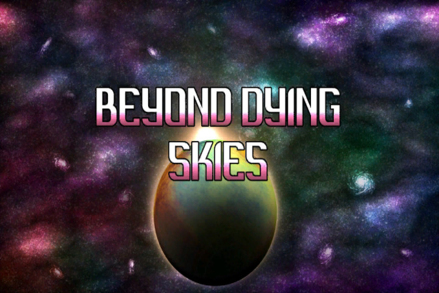
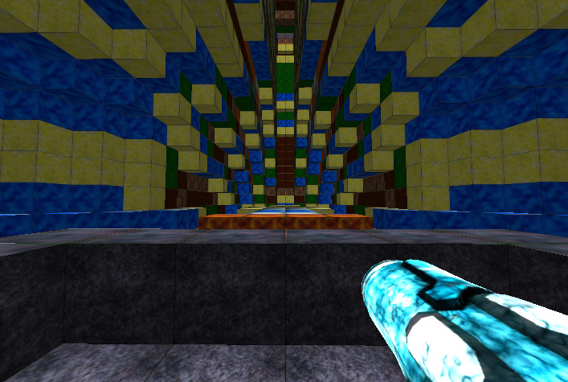
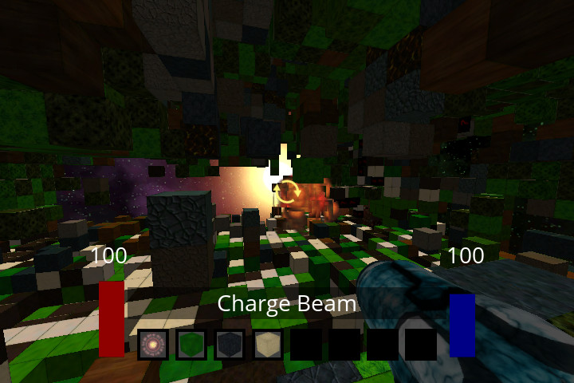
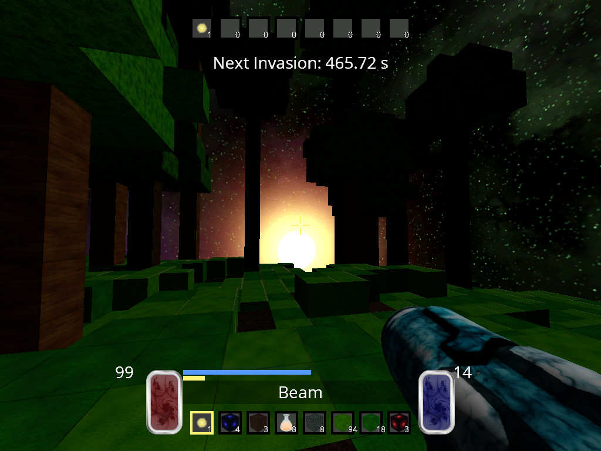

# Beyond Dying Skies
## Repository for the Beyond Dying Skies PC game, Linux and Windows versions.

Welcome to the Beyond Dying Skies GitHub repository! This is the prerelease alpha version 0.1.

This package is the source code distribution of the Beyond Dying Skies, hence abbreviated BDS. The library builds on linux and win32 platforms. 
A GNU makefile is available for compilation with GCC/MINGW for win32 platforms or GCC/X11 for linux platforms. 
The makefile should work for both environments without modification. 

### Main Project Site
[Main Project Site](https://aaron-sp.github.io/index.html)

### YouTube Channel!

### PKGBUILD

If you are running Arch Linux, I have created PKGBUILD's for this project located at https://github.com/Aaron-SP/pkgbuild/blob/master/bds/PKGBUILD.

### Building

Verify a bin directory exists before compiling with the makefile. 
- 'mkdir -p bin'

### The GNU makefile contains various build targets.
- 'make' - builds with dynamic MGL library with dynamic linking
- 'make static' - builds with sources statically with static linking
- 'make inline-dynamic' - builds with inline sources with dynamic linking
- 'make inline-static' - builds with inline sources with static linking
- 'make clean' - cleans up all generated output files
- 'make clear' - clears save files created by the game
- 'make install' - builds and installs the game to /opt/bds
- 'make uninstall' - uninstalls the game from /opt/bds
- 'make BUILD=[arch32|arch64|debug]'
    - BUILD specifies the compilation architecture, 32-bit, 64-bit, or debug.
    - If BUILD is not defined it will default to native architecture

These build targets have been tested for compilation on Arch Linux x64 and Windows 7 x86/x86-x64 platforms.

### Dependencies for each platform

Additional dependencies that are required and not distributed in this package include:
- 'mgl' - Minimal Graphics Library (https://github.com/Aaron-SP/mgl) 
    - run 'make install' to copy header files into /usr/include/mgl
- 'g++-5.4' - all platforms
- 'freetype' - all platforms
- 'opengl3.3+' - all platforms
- 'mingw32'/'mingw64' - for win32 only
- 'X11' - for linux only

### Makefile install target
By default, the makefile will install the game in the /opt/bds directory. You can override this location with the $(DESTDIR) variable in the makefile.
You can run this makefile target with the following commands. 
- `make`
    - Builds the game with whatever settings you want
- `make install`
    - Installs the game into the directory you choose

With OpenGL 4.3 and geometry shader optimizations.
- `make MGL_GS_RENDER=true MGL_VB43=true install`

Customizing the install location.
- `make DESTDIR=/opt/custom MGL_GS_RENDER=true MGL_VB43=true install`

The install target will create a bash script with $(DESTDIR) captured inside of it. This bash script is called bds.game and will be symlinked into /usr/bin. This allows you to run the game from any directory, since the script will always internally switch to the correct directory to run the game. This is important because the game assumes it will be run in the root folder, and otherwise will not be able to locate the data files.

### Makefile uninstall target
By default, the makefile will uninstall the game from the /opt/bds directory. You can override this location with the $(DESTDIR) variable in the makefile.
Be extremely careful using this, the uninstall target will not check if the directory is valid. It will simply remove files from this directory after prompting the user to confirm deletion of files and directories. 

**USE THIS TARGET AT YOUR OWN RISK OF DELETING IMPORTANT FILES**

### Optional build options

The $(MGL_DESTDIR) bash variable will override the GNU makefile with the path looking for MGL installed on the system.
The default path is 'C:/cygwin/usr/i686-w64-mingw32/sys-root/mingw/include' for CYGWIN x86 or '/usr/include' for Linux systems.

### Compile Flags

An alternative rendering mode can be enabled by exporting a variable to bash before compiling with the makefile.
- `export MGL_GS_RENDER=true`

You can also pass this variable directly to the makefile without exporting.
- `make MGL_GS_RENDER=true`

This mode benefits computers with slow CPU's but have modern GPU's that run geometry shaders quickly.

MGL_INST_RENDER is no longer supported.

An alternative VBO mode can be enabled by exporting a variable to bash before compiling with the makefile.
- `export MGL_VB43=true`

You can also pass this variable directly to the makefile without exporting.
- `make MGL_VB43=true`

This mode allows faster vertex_buffer.bind_buffer() switching because it uses OpenGL 4.3 features to separate VBO specification from within VAO state. This mode requires using a OpenGL 4.3 core profile.

**When installing using `sudo`, pass the compile flags directly to the makefile, since the variables will not be defined using export due to switching of user environments.**

### For compiling on CYGWIN:

1. Add a symbolic link to the mingw g++ executable (example for x86):
- ln -s /usr/bin/i686-w64-mingw32-g++.exe /usr/bin/g++.exe
    
2. Add the following paths to your ENVIRONMENT.

#### PATHS FOR CYGWIN x86:
- C:\cygwin\lib\gcc\i686-w64-mingw32\5.4.0\include;
- C:\cygwin\usr\i686-w64-mingw32\sys-root\mingw\include;
- C:\cygwin\usr\i686-w64-mingw32\sys-root\mingw\bin;

#### PATHS FOR CYGWIN x86-64:
- C:\cygwin\lib\gcc\x86_64-w64-mingw32\5.4.0\include;
- C:\cygwin\usr\x86_64-w64-mingw32\sys-root\mingw\include;
- C:\cygwin\usr\x86_64-w64-mingw32\sys-root\mingw\bin;

### Run flags

#### -fps flag
The '-fps' flag is an optional parameter for controlling the target playback frame count per second. The default is 60. Adjusting the '-fps' flag may affect the playback speed of the game. If you use a multiple of 180 i.e... 1, 15, 30, 45, 60, or 90 the game time will match the time of our universe.
- Example: 'bin/game -fps 45' will render 45 frames per second.

#### -chunk flag
The '-chunk' flag is an optional parameter for controlling the size of each chunk. The default is 8 and must be an even divisible factor of the grid size, and greater than or equal to 2. Smaller chunk sizes allow the GPU to drop more terrain fragment calculations due to the early fragment test. High chunk sizes can greatly diminish performance on lesser hardware. Chunk sizes too small however can drastically increase the number of draw calls per frame.
- Example: 'bin/game -chunk 8' produce chunks of size 8 x 8 x 8.

#### -grid flag
The '-grid' flag is an optional parameter for controlling the half size of world grid. The default is 64 and must be greater than or equal to 4.
Any previous saves will be deleted upon resizing the game grid to avoid crashing the game.
- Example: 'bin/game -grid 36 -chunk 6' produce a grid of size 72x72x72 and chunks of size 6 x 6 x 6.

#### -view flag
The '-view' flag is an optional parameter for controlling how many chunks are viewable on the screen. The default is 5 and must be an odd number greater than one.
- Example: 'bin/game -view 15' will render 7 chunks on each side of the player, (7 * 2) + 1 = 15.

#### -width flag and -height flag
The '-width' and '-height' flag changes the default window dimensions.
- Example: 'bin/game -width 1600 -height 900' will create a window width of 1600 pixels and height of 900 pixels.

#### --no-persist flag
The '--no-persist' flag ignores any saved key map layout.
- Example: 'bin/game --no-persist' will default to qwerty key mapping.

#### --qwerty flag
The '--qwerty' flag changes the default key mapping to QWERTY key map layout.
- Example: 'bin/game --qwerty --no-persist' will force qwerty key mapping.

#### --dvorak flag
The '--dvorak' flag changes the default key mapping to DVORAK key map layout.
- Example: 'bin/game --dvorak --no-persist' will force dvorak key mapping.

### SCREENSHOTS!

#### Title Screen

#### Pre-Texture Update

#### Texture Update

#### Shader Update

### PLAYER USAGE INSTRUCTIONS:

1. Keys [WASD]: forward/left/back/right
2. Key [TAB]: open and close inventory screen
3. Key [Q]: drops item if hovering in inventory screen
4. Key [E]: select current target
5. Keys [Z/X/C]: scale unit block (block place mode)
6. Key [R]: reset scale unit block (block place mode)
7. Keys [1-8]: quick item hotbar, use item, place block, equip weapon
8. Left mouse: use skill (edit mode / power suite mode)
9. Right mouse and hold: target and track block
10. [SPACE] jump, can double jump after dynamism unlock
11. [SHIFT] dash, dashs in the forward direction after dynamism unlock
12. Key [F1]: toggle debug text
13. Key [F2]: toggle wireframe mode
14. Key [F3]: music up
15. Key [F4]: music down
16. Key [ESCAPE]: pause the game

### Segmentation Fault: I crashed the game!
If you crash the game, compile the game with debug settings with 'make BUILD=debug' and run the game in GDB. 'gdb bin/game' should suffice. When GDB loads, type 'run' to launch the game inside the GDB debugger. When the game crashes/freezes, go to the GDB window and type 'where' and GDB should print a stacktrace using debug symbols. This GDB stacktrace allows developers to figure out the function that crashed the game and expedites the debug process, and hopefully will lead to getting those critical bugs fixed.

### Optimization: Help! I am lagging!
Lag usually comes in two forms, a CPU bottleneck or a GPU bottleneck. If you are CPU bottlenecked, expect most of your CPU time going to creating terrain memory buffers.

#### CPU Bottleneck
The MGL_VB43 compile time flag can only be used on OpenGL 4.3 systems, but will reduce the number of OpenGL calls by a factor of 2. 
If your GPU supports OpenGL geometry shaders, the MGL_GS_RENDER compile time flag should alleviate any CPU bottleneck since it removes the need for the CPU to create terrain memory buffers. However this can **increase lag if** your GPU doesn't render geometry shaders efficiently. 

MGL_INST_RENDER is no longer supported.

Known CPU bottleneck system configurations include AMD Phenom II x4 965 + Radeon HD 5770. However the MGL_VB43 and MGL_GS_RENDER increase performance to playable status, where previously the game would be unplayable.

#### Running Linux?
If you are running Linux, consider disabling any desktop compositor that may be running. The desktop compositor that runs with KDE Plasma can increase lag significantly.

#### GPU Bottleneck
If you have tried all previous steps and failed, you are likely GPU bottlenecked. In this case you are lagging simply because the GPU can not draw all of the pixels on the screen. The most obvious remedy to this problem is to reduce your screen dimensions using the '-width' and '-height' command line flags. 

However you can also try changing the size of the view frustum and chunk size using the '-view' and '-chunk' command line flags. By default the view frustum consists of 125 chunks, 5x5x5. This is actually alot of geometry to render, so we only draw the chunks inside the camera frustum which is on average ~35 (but can be 125 on a world edge). Decreasing the chunk size directly decreases the number of triangles drawn at any one time. The view frustum's lowest value is 27 chunks. Increasing the frustum will draw more chunks and thus more geometry. Smaller chunks will allow the GPU to perform more early fragment test optimizations in between draw calls and is the main reason high chunk sizes cause enormous lag.

You can also set the render speed of the game by using the '-fps' command line flag. The default is 60 and if you are lagging you can drop down to 30 without many issues. However, decreasing the frames per second will increase the workload for the physics engine because it is coded to run at 180 times per second independent of the frame count. Thus decreasing the frame count will increase the number of physics iterations per frame. This is only important if you are both CPU and GPU bottlenecked.
