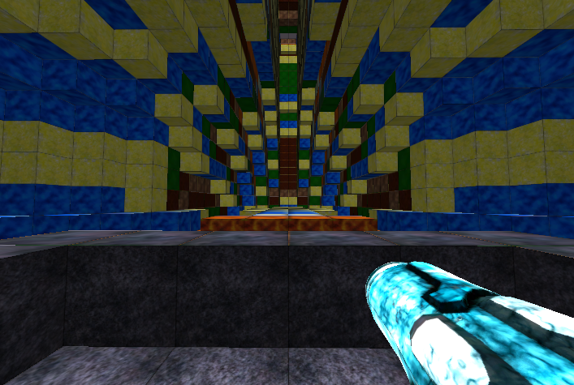

# Fractex
## Repository for the Minimal Graphics Library Fractal Explorer

Verify a bin directory exists before compiling with the makefile. 
- 'mkdir -p bin'

### The GNU makefile contains various build targets.
- 'make' - builds game and tests targeting 'native'
- 'make build' - builds game and targeting 'native'
- 'make build32' - builds game and targeting 'x86'
- 'make build64' - builds game and targeting 'x86-64'
- 'make tests' - builds only tests targeting 'native'
- 'make clean' - cleans up all generated output files

These build targets have been tested for compilation on Arch Linux x64 and Windows 7 x86/x86-x64 platforms.

### Dependencies for each platform

Additional dependencies that are required and not distributed in this package include:
- 'mgl' - Minimal Graphics Library (https://github.com/Aaron-SP/mgl)
- 'g++-5.4' - all platforms
- 'freetype' - all platforms
- 'opengl3.3+' - all platforms
- 'mingw32'/'mingw64' - for win32 only
- 'X11' - for linux only

### Optional build options

The $(MGL_DESTDIR) bash variable will override the GNU makefile with the path looking for MGL installed on the system.
The default path is 'C:/cygwin/usr/i686-w64-mingw32/sys-root/mingw/include' for CYGWIN x86 or '/usr/include' for Linux systems.

An alternateive rendering mode can be enabled by exporting a variable to bash before compiling with the makefile.
- 'export MGL_GS_RENDER=true'

This mode benefits computers with slow CPU's but have modern GPU's that run geometry shaders quickly.

### For compiling on CYGWIN:

1. Add a symbolic link to the mingw g++ executable (example for x86):
- ln -s /usr/bin/i686-w64-mingw32-g++.exe /usr/bin/g++.exe
    
2. Add the following paths to your ENVIRONMENT.

#### PATHS FOR CYGWIN x86:
- C:\cygwin\lib\gcc\i686-w64-mingw32\5.4.0\include;
- C:\cygwin\usr\i686-w64-mingw32\sys-root\mingw\include;
- C:\cygwin\usr\i686-w64-mingw32\sys-root\mingw\bin;

#### PATHS FOR CYGWIN x86-64:
- C:\cygwin\lib\gcc\x86_64-w64-mingw32\5.4.0\include;
- C:\cygwin\usr\x86_64-w64-mingw32\sys-root\mingw\include;
- C:\cygwin\usr\x86_64-w64-mingw32\sys-root\mingw\bin;

### Run flags

#### -fps flag
The '-fps' flag is an optional parameter for controlling the target playback frame count per second. The default is 60.
- Example: 'fractex -fps 45' will render 45 frames per second.

#### -chunk flag
The '-chunk' flag is an optional parameter for controlling the size of each chunk. The default is 32 and must be an even divisible factor of the grid size, 128.
- Example: 'fractex -chunk 16' produce chunks of size 16x16x16.

#### -view flag
The '-view' flag is an optional parameter for controlling how many chunks are viewable on the screen. The default is 3 and must be an odd number greater than one.
- Example: 'fractex -view 31' will render 15 chunks on each side of the player, (15 * 2) + 1 = 31.

### PLAYER USAGE INSTRUCTIONS:

1. Keys [WASD]: forward/left/back/right
2. Key [Q]: switch between block edit mode and power suit mode
3. Keys [ZXC]: scale unit block (block edit mode)
4. Key [E]: reset scale unit block (block edit mode)
5. Keys [1-8]: switch textures (edit mode), switch power suit skills (power suit mode)
6. Left mouse: use skill (edit mode / power suite mode)
7. Key [F1]: quit
8. Key [F2]: toggle debug text
9. Key [ESCAPE]: pause the game

